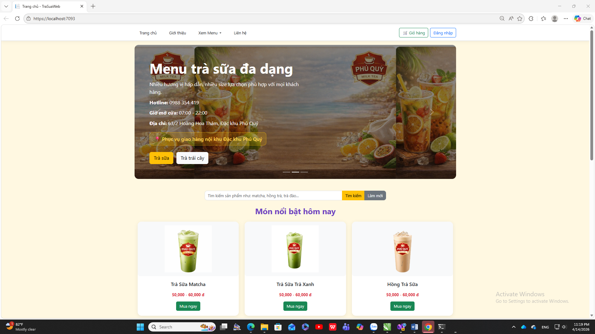
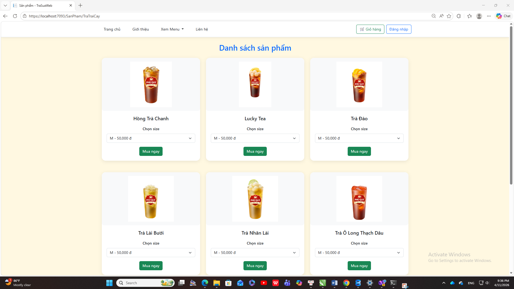
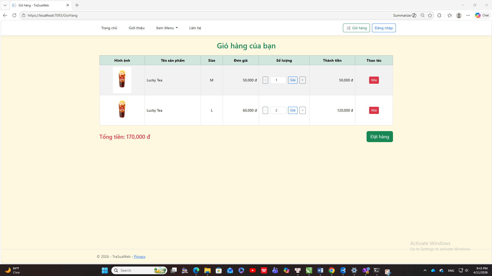
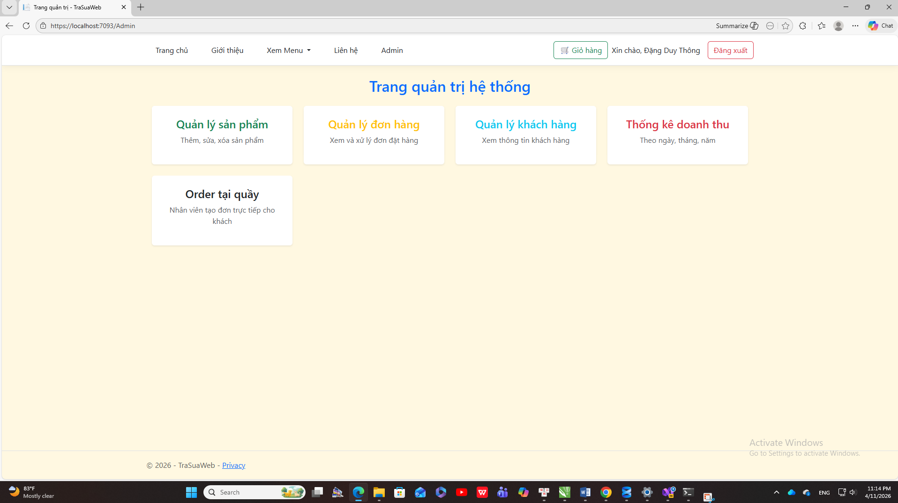

# ASPNET-DK24TTC5-dangduythong-TraSuaWeb
project xây dựng trang web bán trà sữa

# 🧋 WEBSITE BÁN TRÀ SỮA (Milk Tea Web)

## 📌 Giới thiệu dự án
Dự án “Xây dựng website bán trà sữa” là một ứng dụng web được phát triển nhằm hỗ trợ hoạt động bán hàng và quản lý cho các cửa hàng trà sữa.

Hệ thống giúp khách hàng dễ dàng xem sản phẩm, lựa chọn và đặt hàng trực tuyến. Đồng thời, quản trị viên có thể quản lý sản phẩm, đơn hàng, khách hàng và theo dõi doanh thu một cách hiệu quả.

Dự án hướng đến mục tiêu thay thế phương pháp quản lý thủ công, nâng cao hiệu quả vận hành và cải thiện trải nghiệm người dùng.

---

## 🎯 Mục tiêu
- Xây dựng hệ thống bán trà sữa trực tuyến
- Hỗ trợ quản lý sản phẩm, khách hàng và đơn hàng
- Tối ưu quy trình bán hàng cho cửa hàng nhỏ và vừa
- Áp dụng kiến thức lập trình web ASP.NET vào thực tế

---

## ⚙️ Chức năng chính

### 👤 Đối với khách hàng
- Đăng ký / Đăng nhập
- Xem danh sách sản phẩm
- Tìm kiếm sản phẩm
- Thêm sản phẩm vào giỏ hàng
- Cập nhật giỏ hàng
- Đặt hàng trực tuyến

### 🛠️ Đối với quản trị viên (Admin)
- Đăng nhập quản trị
- Quản lý sản phẩm (thêm / sửa / xóa)
- Quản lý danh mục
- Quản lý khách hàng
- Quản lý đơn hàng
- Order tại quầy
- Thống kê và báo cáo doanh thu

---

## 🛠️ Công nghệ sử dụng
- ASP.NET  (MVC)
- Ngôn ngữ: C#
- Cơ sở dữ liệu:  SQL Server
- Frontend: HTML, CSS, JavaScript
- Framework: Bootstrap

---

## 🏗️ Kiến trúc hệ thống
Hệ thống được xây dựng theo mô hình 3 lớp (Three-Tier Architecture):
- Presentation Layer: Giao diện người dùng
- Business Logic Layer: Xử lý nghiệp vụ
- Data Access Layer: Kết nối và thao tác với cơ sở dữ liệu

---

## 🗄️ Cơ sở dữ liệu
Các bảng chính trong hệ thống:
- DanhMuc (Category)
- SanPham (Product)
- SizeSanPham (Product Size)
- KhachHang (Customer)
- TaiKhoan (Account)
- DonHang (Order)
- ChiTietDonHang (Order Detail)

---

## 📷 Hình ảnh minh họa

### Trang chủ

### Trang sản phẩm

### Trang giỏ hàng

### Trang quản trị

## 🚀 Hướng dẫn cài đặt và chạy project

### 🔧 Yêu cầu
- Visual Studio 2022/2026
- SQL Server
- .NET Framework / .NET Core

---

## Hướng dẫn cài đặt

1. Tải project về:
- Clone hoặc Download ZIP từ GitHub

2. Mở project bằng Visual Studio

3. Cấu hình database:
- Tạo database TraSuaDB trong SQL Server
- Mở file script SQL và chạy

4. Cập nhật connection string trong appsettings.json

5. Chạy project:
- Nhấn F5 hoặc Ctrl + F5

--------
📊 Kết quả đạt được

* Hệ thống hoạt động ổn định trên môi trường localhost
* Giao diện thân thiện, dễ sử dụng
* Quản lý dữ liệu hiệu quả
* Hỗ trợ đặt hàng trực tuyến và tại quầy
* Báo cáo doanh thu chính xác

⚠️ Hạn chế

* Chưa tối ưu trên thiết bị di động
* Chưa tích hợp thanh toán online
* Chưa có hệ thống thông báo (Email/SMS)

⸻

🔮 Hướng phát triển

* Tích hợp thanh toán online (Momo, VNPay)
* Phát triển phiên bản mobile
* Thêm chức năng thông báo đơn hàng
* Tối ưu UI/UX

⸻

👨‍💻 Thông tin sinh viên

* Họ tên: Đặng Duy Thông
* MSSV: 170124506
* Lớp: DK24TTCS
* Trường: Đại học Trà Vinh

⸻

❤️ Lời cảm ơn

Xin chân thành cảm ơn giảng viên hướng dẫn đã hỗ trợ trong quá trình thực hiện đồ án.
